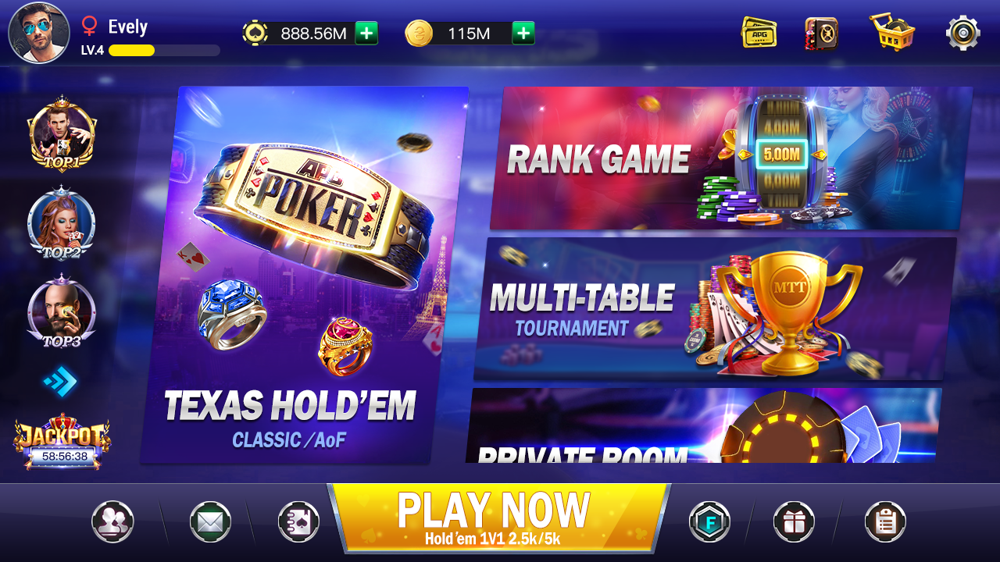
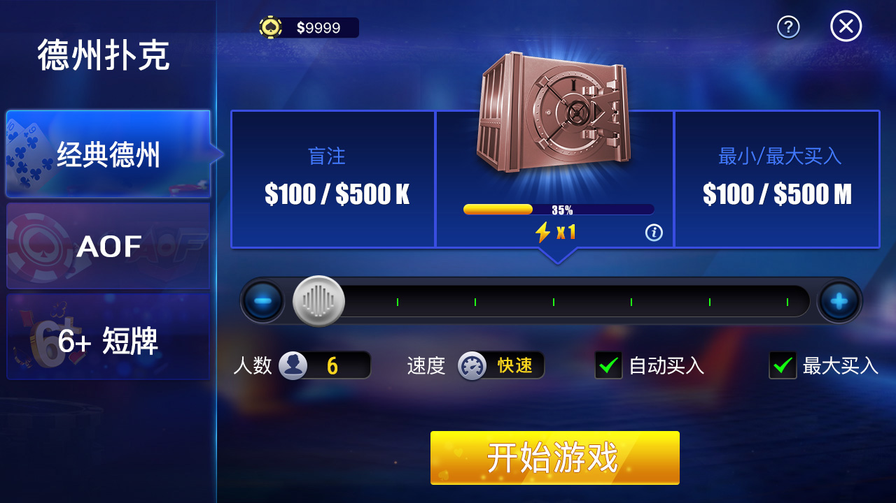
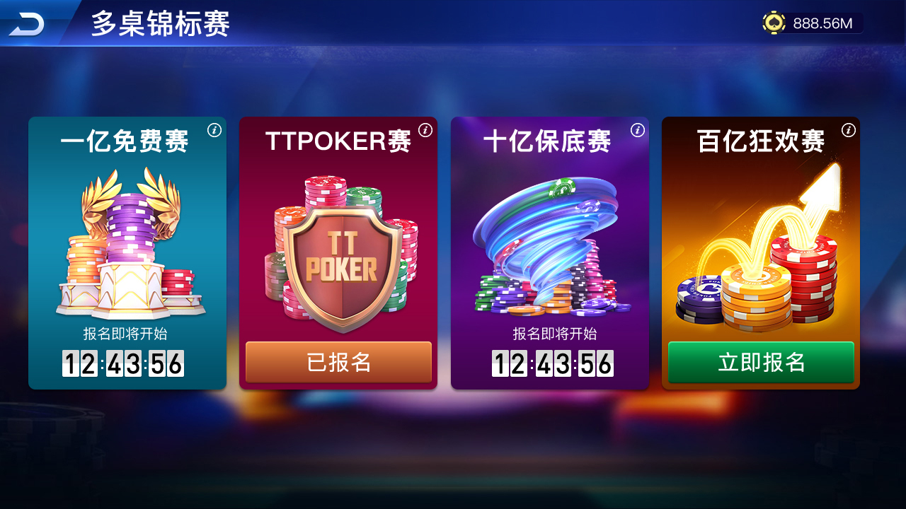
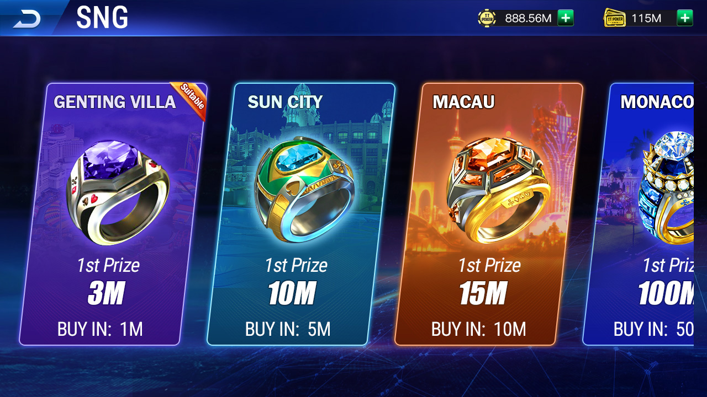
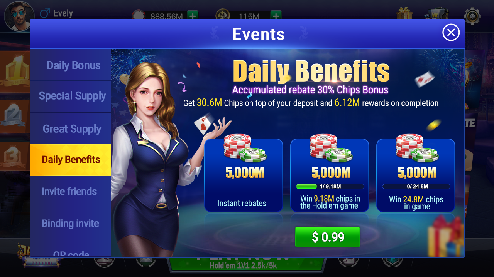
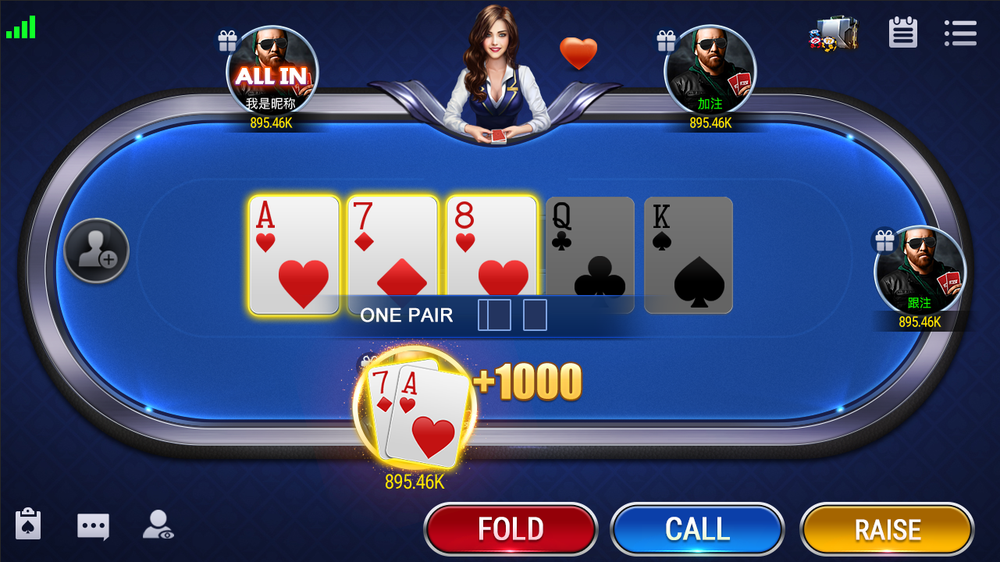
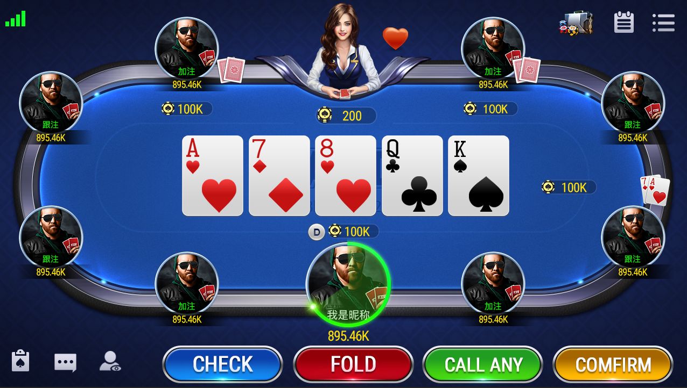

# 德州源码 | 德州扑克源码 | 德州扑克游戏完整源码 | Texas Hold'em Poker Complete Source Code

**德州扑克源码** · **德州扑克游戏源码** · **德州金币大厅源码** · **德州俱乐部源码**  
**Unity3D + C++ | 金币大厅 + 俱乐部 + MTT锦标赛 + 多语言 | 支持iOS/Android/H5**

一款功能完整的德州扑克在线游戏源码。包含金币大厅、俱乐部系统、多种玩法（经典德州、短牌等）、MTT/SNG锦标赛、商城、充值、排行榜等模块。适合二次开发、商用部署或搭建自己的德州扑克平台。

[立即联系获取在线演示、完整源码与商用授权](#联系我们)

[](https://t.me/xuzongbin001)
[]()
[]()
[]()

---

## ✨ 核心特性

- **金币大厅系统**：完整经济系统、充值、消费、奖励
- **多种玩法**：经典德州扑克、短牌、SNG、MTT多桌锦标赛
- **俱乐部与社交系统**：俱乐部创建、管理、朋友局、私房
- **商城与运营系统**：签到、道具商城、任务系统
- **战绩与排名**：详细统计、赛季排行榜
- **多平台支持**：Unity3D 客户端（iOS / Android / H5 / PC）
- **服务端**：C++ 高性能后端

## 🎥 产品演示视频（强烈推荐观看）

[](https://youtu.be/iuFM8RJGU8s)

**点击上方图片跳转观看视频**  
德州扑克完整功能演示 | 金币大厅 + 俱乐部 + MTT锦标赛 + 实时对战

## 🎯 功能清单
✅ 德州AI陪玩 ✅ 金币大厅 ✅ 俱乐部系统
✅ 多国语言 ✅ 用户系统 ✅ 房间管理
✅ 商城系统 ✅ 充值系统 ✅ 排行榜
✅ 任务系统 ✅ 签到系统 ✅ 战绩统计


## 📸 游戏界面真实截图 / Screenshots

  
**金币大厅界面 | Gold Coin Hall**

  
**经典德州牌桌界面 | Classic Texas Hold'em**

  
**多桌锦标赛界面 | Multi-Table Tournament**

  
**SNG竞赛界面 | Sit & Go**

  
**活动中心界面 | Events**

  
**牌桌胜利提示界面 | Win Notification**

  
**荷官打赏界面 | Dealer Tip**


🎥 **演示视频**：[联系我获取在线演示](https://t.me/xuzongbin001)

## 💰 获取源码

✅ 完整C++服务端源码  
✅ 完整Unity3D客户端源码  
✅ 数据库脚本  
✅ 美术资源  
✅ 部署文档  

## 🛠 技术栈

- 客户端：Unity3D (C#)
- 服务端：C++
- 数据库：MySQL + Redis
- 支持平台：iOS、Android、H5、PC

## 📜 许可与授权

本仓库为展示版本，仅供学习研究参考。  
**商用授权、完整源码包、技术支持**请联系我们获取正式许可。

## 📞 联系我们

- **Telegram**：@xuzongbin001  
- **Email**：masterai918@gmail.com

欢迎咨询价格、在线演示、功能定制及部署支持等事宜。


🎯 Use Cases
AI research
Game simulation
Reinforcement learning experiments
📊 Why This Project

Compared to typical poker source code:

Focus on AI modeling
Clean architecture
Simulation-ready
⚠️ Disclaimer
For research and educational purposes only
No real-money or gambling features
## 🧠 AI Overview

This project models decision-making in complex environments:

- Imperfect-information games  
- Multi-agent interaction  
- Strategy optimization  

---

## ⚙️ Key Features

- Poker AI decision engine  
- Simulation environment  
- Strategy evaluation system  
- Modular architecture  

---

## 🚀 Quick Start

```bash
git clone https://github.com/your-repo
cd project
run main

⭐ Star 这个仓库，支持优质德州源码持续分享！

## 🔍 Keywords

Texas Holdem AI, Poker AI Engine, Multiplayer Poker System, Poker Game Server, C++ Poker Engine, Poker Simulation
