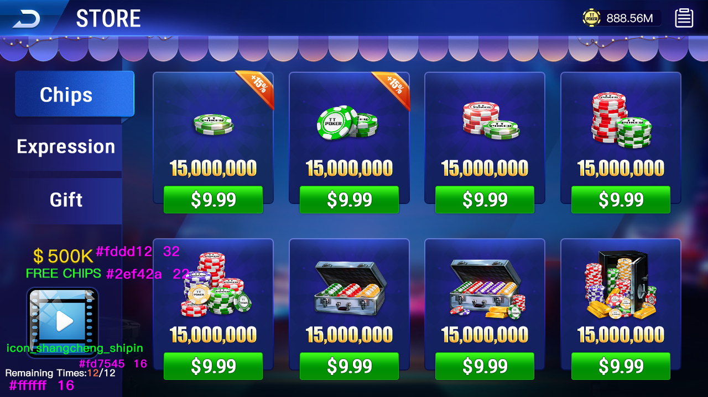

# 🎰 德州扑克AI完整源码 | 金币大厅+俱乐部 | 多国语言

> **德州AI + 金币大厅 + 俱乐部系统 + 多国语言 | C++完整服务端**

[](https://t.me/xuzongbin001)
[]()
[]()
[]()

---

## ✨ 核心特色

| 特色模块 | 说明 |
| :--- | :--- |
| 🧠 **德州AI** | 内置AI机器人，可陪玩/对战 |
| 🪙 **金币大厅** | 完整经济系统，金币玩法 |
| 👥 **俱乐部系统** | 俱乐部创建、管理、赛事 |
| 🌍 **多国语言** | 支持多个国家语言，适合出海 |
| 📱 **多端支持** | Unity3D + Web + H5 |
| 🏆 **稳定运营** | 成熟代码，可直接上线 |

## 🎯 功能清单
✅ 德州AI陪玩 ✅ 金币大厅 ✅ 俱乐部系统
✅ 多国语言 ✅ 用户系统 ✅ 房间管理
✅ 商城系统 ✅ 充值系统 ✅ 排行榜
✅ 任务系统 ✅ 签到系统 ✅ 战绩统计


## 🚀 产品演示视频（强烈推荐观看）

[](https://youtu.be/iuFM8RJGU8s)

**点击上方图片即可跳转观看视频**  
德州扑克完整功能演示 | 金币大厅 + 俱乐部系统 + MTT锦标赛 + 短牌玩法 + 实时多人对战


## 📸 界面预览

## 📸 游戏界面真实截图 / Screenshots

  
**金币大厅界面 | Gold Coin Hall**

  
**经典德州牌桌界面 | Classic Texas Hold'em**

  
**多桌锦标赛界面 | Multi-Table Tournament**

  
**SNG竞赛界面 | Sit & Go**

  
**商城系统界面 | Shop / Mall**

  
**活动中心界面 | Events**

  
**牌桌胜利提示界面 | Win Notification**

  
**荷官打赏界面 | Dealer Tip**


🎥 **演示视频**：[联系我获取在线演示](https://t.me/xuzongbin001)

## 💰 获取源码

✅ 完整C++服务端源码  
✅ 完整Unity3D客户端源码  
✅ 数据库脚本  
✅ 美术资源  
✅ 部署文档  

📱 **Telegram：@xuzongbin001**  
📧 **Email：masterai918@gmail.com**

👉 **联系我获取演示站 + 详细报价**

🎯 Use Cases
AI research
Game simulation
Reinforcement learning experiments
📊 Why This Project

Compared to typical poker source code:

Focus on AI modeling
Clean architecture
Simulation-ready
⚠️ Disclaimer
For research and educational purposes only
No real-money or gambling features
## 🧠 AI Overview

This project models decision-making in complex environments:

- Imperfect-information games  
- Multi-agent interaction  
- Strategy optimization  

---

## ⚙️ Key Features

- Poker AI decision engine  
- Simulation environment  
- Strategy evaluation system  
- Modular architecture  

---

## 🚀 Quick Start

```bash
git clone https://github.com/your-repo
cd project
run main

⭐ Star 这个仓库，支持优质德州源码持续分享！


